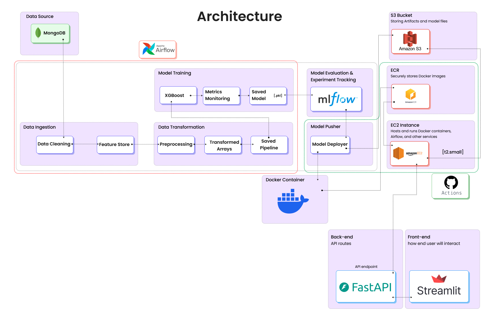
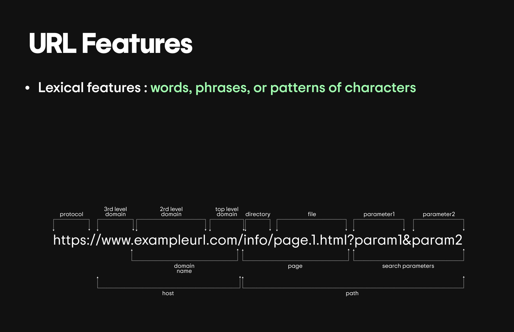
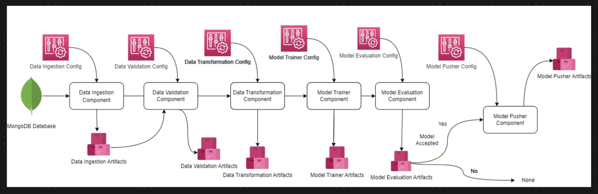
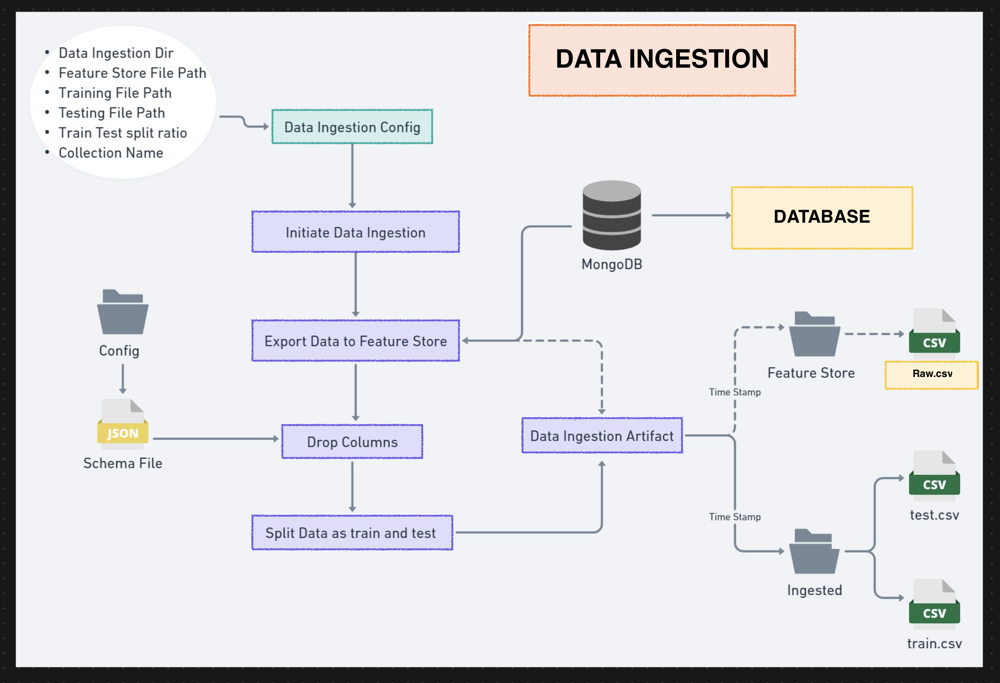
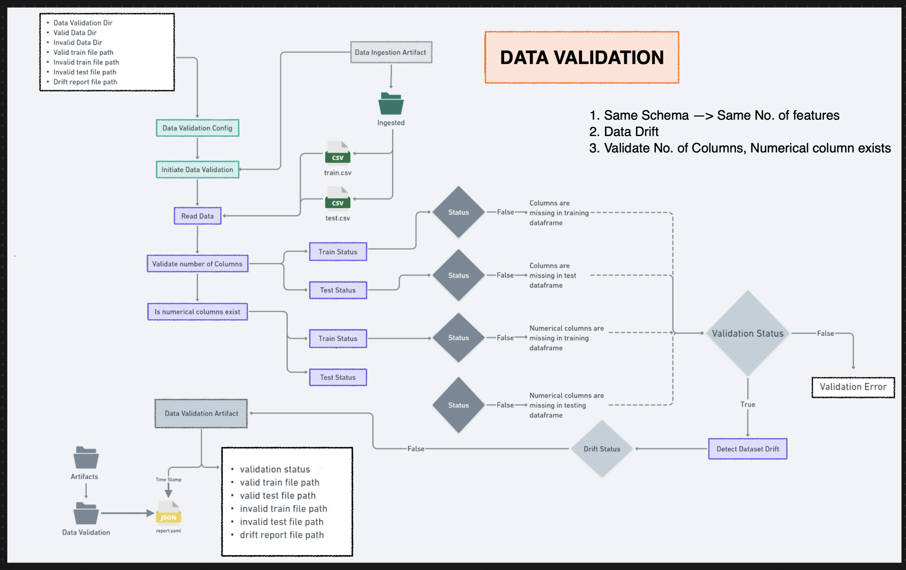
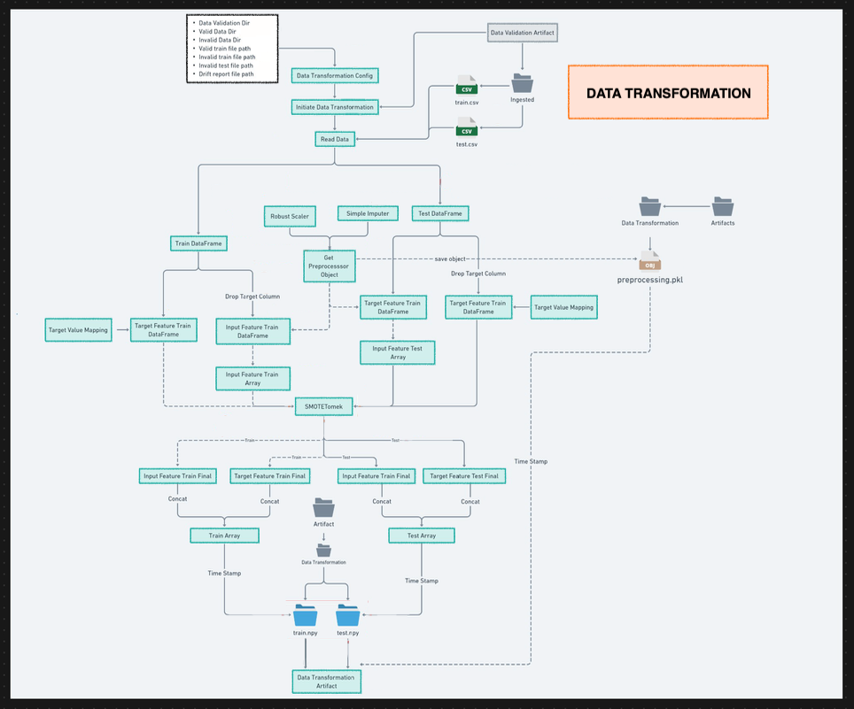
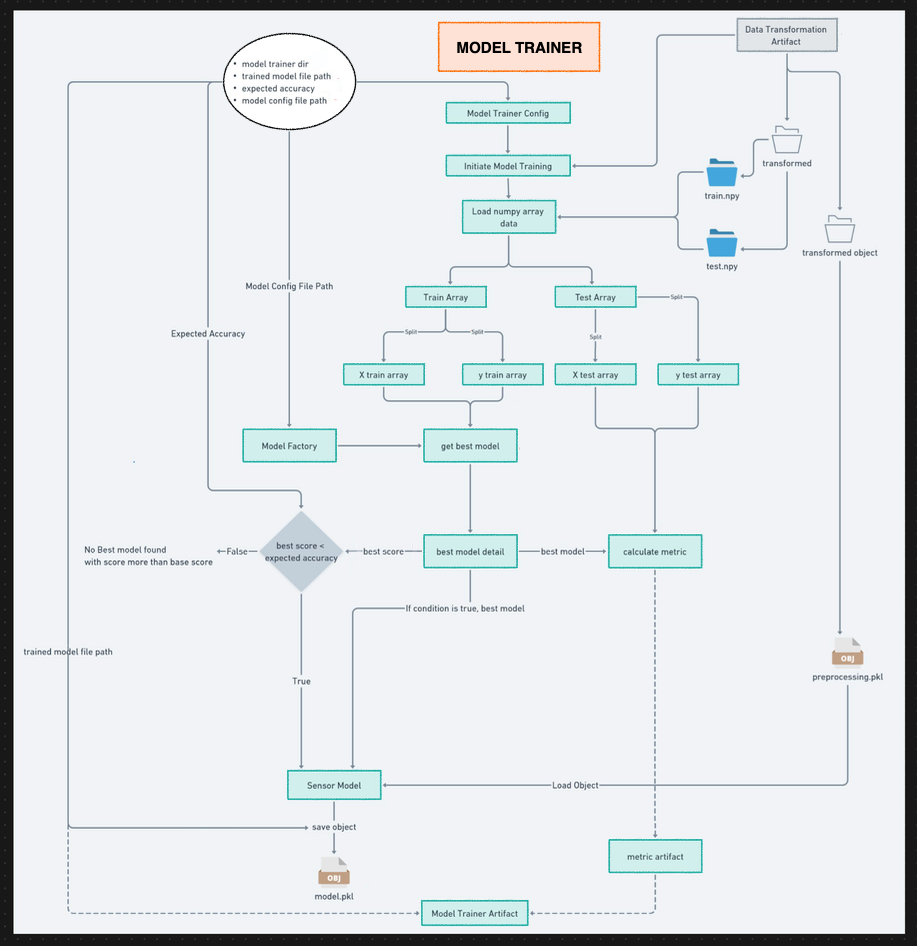

# NetSentinel MLOps

This repository contains an end-to-end Machine Learning Operations (MLOps) project designed to train, evaluate, and deploy a model that classifies malicious phishing websites. The project implements a robust, modular, and automated pipeline that covers the entire machine learning lifecycle, from data ingestion from MongoDB to a containerized deployment on AWS EC2, fully automated with GitHub Actions.


## 📋 Table of Contents
1.  [🎯 Project Overview](#project-overview)
2.  [✨ Key Features](#features)
3.  [🛠️ Tech Stack](#tech-stack)
4.  [📊 Dataset and Features](#dataset-and-features)
5.  [🏗️ MLOps Pipeline Workflow](#project-workflow)
6.  [☁️ CI/CD and AWS Deployment](#ci-cd-deployment)
7.  [🚀 Getting Started](#getting-started)
8.  [📁 Project Structure](#project-structure)

---

## <a id="project-overview"></a>🎯 Project Overview

This project demonstrates a complete ML lifecycle, from data ingestion to a production-ready API. It incorporates best practices such as experiment tracking, data validation with drift detection, custom logging, and robust exception handling. The final model is served via a FastAPI application, which is containerized with Docker and deployed to an AWS EC2 instance.

The core goal is to create a scalable and maintainable system that can automatically train, evaluate, and deploy a machine learning model for identifying malicious network traffic.

**Overall Architecture**


---

## <a id="features"></a>✨ Key Features

- **Modular & Scalable Architecture**: The code is structured into reusable components for each stage of the ML pipeline (ingestion, validation, transformation, training), ensuring maintainability.
- **End-to-End MLOps Pipeline**: A fully automated workflow that orchestrates the entire model training process, from fetching raw data to storing a production-ready model, ensuring reproducibility.
- **Data Validation & Drift Detection**: Employs schema validation and the Kolmogorov-Smirnov test to ensure data quality and detect distribution changes between datasets.
- **Experiment Tracking**: Integrated with **MLflow** and **DagsHub** to log model parameters, metrics (F1-score, Precision, Recall), and artifacts for every experiment.
- **CI/CD Automation**: A **GitHub Actions** workflow automates the entire process of building a Docker image, pushing it to a container registry, **AWS ECR**, and deploying it to **AWS EC2**.
- **Cloud-Native Deployment**: The application is containerized using **Docker** and deployed on **AWS**, with artifacts and models stored in **S3** and container images in **ECR**.
- **REST API Interface**: A **FastAPI** application serves the trained model via `/train` and `/predict` endpoints, allowing for retraining and real-time predictions.

---

## <a id="tech-stack"></a>🛠️ Tech Stack

| Category | Tools/Technologies | Description |
| :--- | :--- | :--- |
| **Backend & API** | FastAPI, Uvicorn | Serves the model via REST API endpoints for training and prediction. |
| **Modeling** | Scikit-learn, Pandas, NumPy | Core libraries for data manipulation, transformation, and model training. |
| **Database** | MongoDB | Stores the initial raw dataset for the ingestion pipeline. |
| **Experiment Tracking** | MLflow, DagsHub | Tracks model experiments, logs metrics, parameters, and artifacts. |
| **CI/CD** | GitHub Actions | Automates the CI/CD pipeline, from building to deployment. |
| **Containerization** | Docker, AWS ECR | Packages the application into a **Docker** image and stored securely in **ECR**. |
| **Cloud Storage** | AWS S3 | Stores all ML artifacts, including datasets, models, and reports. |
| **Cloud Hosting** | AWS EC2 Instance | Serves as a **self-hosted runner** for GitHub Actions to deploy the application. |

---

## <a id="dataset-and-features"></a>📊 Dataset and Features

The model is trained on a dataset of URLs, each characterized by a set of 31 lexical and network-based features. These features are extracted from the URL's structure, domain properties, and page content to identify patterns associated with malicious websites.

The image below breaks down the fundamental structure of a URL, from which many of the lexical features are derived.



### Key Features Used

The following table describes some of the key features used to train the classification model:

| Feature Name | Description |
| :--- | :--- |
| `having_IP_Address` | Checks if the URL contains an IP address instead of a domain name. |
| `URL_Length` | Measures the length of the URL; longer URLs are often suspicious. |
| `Shortining_Service` | Detects if the URL uses a known shortening service like `bit.ly`. |
| `having_At_Symbol` | Flags the presence of an "@" symbol, which can obscure the true domain. |
| `SSLfinal_State` | Analyzes the SSL certificate's validity and trustworthiness. |
| `Domain_registeration_length` | Checks the registration duration of the domain; shorter lengths are a red flag. |
| `web_traffic` | Measures the website's traffic rank; very low traffic can be suspicious. |

---

## <a id="project-workflow"></a>🏗️ MLOps Pipeline Workflow

The project is structured as a series of interconnected pipeline stages, each responsible for a specific part of the ML lifecycle.

**Pipeline Workflow Overview**


### 1. Data Ingestion
Raw data is extracted from a `MongoDB` collection, split into training and testing sets, and stored as artifacts for the next stage.


### 2. Data Validation
This critical stage validates the ingested data against a predefined schema (`data_schema/schema.yaml`). It checks for column count, data types, and uses a statistical test to detect data drift.


### 3. Data Transformation
Missing values are handled using a `KNNImputer`. A preprocessing pipeline transforms the features, and the resulting datasets are saved as NumPy arrays for efficient model training.


### 4. Model Training
Multiple classification models are trained using `GridSearchCV` for hyperparameter tuning. Each experiment is tracked with `MLflow`, and the best-performing model is selected and saved.


### 5. Artifact Management & Cloud Sync
All pipeline artifacts—datasets, validation reports, trained models, and preprocessors—are automatically synchronized to an **AWS S3 bucket** for persistence and version control.

---

## <a id="ci-cd-deployment"></a>☁️ CI/CD and AWS Deployment

The project uses GitHub Actions for a fully automated CI/CD pipeline, deploying the application to an AWS EC2 instance.

### Pipeline Summary:
1.  **Continuous Integration**: On every push to `main`, jobs for linting and testing are executed.
2.  **Continuous Delivery**: A Docker image is built and pushed to **AWS ECR**.
3.  **Continuous Deployment**: A **self-hosted runner on AWS EC2** pulls the latest image from ECR and deploys the new container, making the API live on port 8080.

---

## <a id="getting-started"></a>🚀 Getting Started

Follow these steps to set up and run the project locally.

### Prerequisites
-   Python 3.8+ and Git
-   A MongoDB account with cluster access
-   An AWS account with programmatic access configured

### Step 1: Clone the Repository
First, clone the repository and navigate to the project directory:
```bash
git clone https://github.com/karanpraja902/NetSentinel-MLOps.git
cd NetSentinel-MLOps
```

### Step 2: Set Up The Environment and Install Dependencies
We recommend using `uv`, a fast, next-generation Python package manager, for setup.

#### Recommended Approach (using `uv`)
1.  **Install `uv`** on your system if you haven't already.
    ```bash
    # On macOS and Linux
    curl -LsSf https://astral.sh/uv/install.sh | sh

    # On Windows
    powershell -c "irm https://astral.sh/uv/install.ps1 | iex"
    ```

2.  **Create a virtual environment and install dependencies** with a single command:
    ```bash
    uv sync
    ```
    This command automatically creates a `.venv` folder in your project directory and installs all listed packages from `requirements.txt`.

    > **Note**: For a comprehensive guide on `uv`, check out this detailed tutorial: [uv-tutorial-guide](https://github.com/karanpraja902/uv-tutorial-guide).

#### Alternative Approach (using `venv` and `pip`)
If you prefer to use the standard `venv` and `pip`:
1.  **Create and activate a virtual environment:**
    ```bash
    python -m venv venv
    source venv/bin/activate  # On Windows use: venv\Scripts\activate
    ```

2.  **Install the required dependencies:**
    ```bash
    pip install -r requirements.txt
    ```

### Step 3: Configure Environment Variables
Create a `.env` file in the root directory with your MongoDB credentials:
```env
MONGO_DB_USERNAME="your-mongodb-username"
MONGO_DB_PASSWORD="your-mongodb-password"
```

### Step 4: Populate the Database
Run this script to populate your MongoDB collection with the sample dataset:
```bash
python push_data.py
```

### Step 5: Running the Project

**A) Execute the Training Pipeline:**
```bash
python test.py
```

**B) Start the FastAPI Server:**
```bash
uvicorn app:app --host 0.0.0.0 --port 8080
```
Access the interactive API docs at `http://localhost:8080/docs`.

---

## <a id="project-structure"></a>📁 Project Structure

```
NetSentinel-MLOps/
├── .github/workflows/main.yaml   # CI/CD pipeline configuration
├── images/                       # For storing diagrams and screenshots
├── network_security/             # Core application source code
│   ├── components/               # Individual pipeline components
│   ├── pipeline/                 # Pipeline orchestration logic
│   ├── entity/                   # Configuration and artifact data classes
│   ├── constant/                 # Project-wide constants
│   ├── cloud/                    # Cloud service utilities (S3 sync)
│   ├── exception/                # Custom exception handling
│   ├── logging/                  # Custom logging configuration
│   └── utils/                    # Utility functions
├── data_schema/schema.yaml       # Data validation schema definition
├── app.py                        # FastAPI application entry point
├── Dockerfile                    # Container configuration
└── requirements.txt              # Python dependencies
```